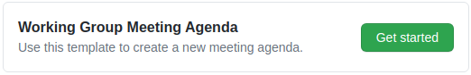
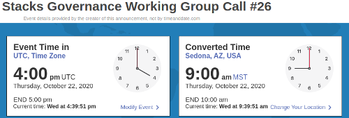

# Stacks Governance - Standard Operating Procedures

This document contains recommended best practices for managing various aspects of the Stacks governance initiative.

<!-- TOC -->

- [Stacks Governance - Standard Operating Procedures](#stacks-governance---standard-operating-procedures)
  - [Get Involved](#get-involved)
  - [Additional Outlets](#additional-outlets)
  - [Governance Working Group Calls](#governance-working-group-calls)
  - [Governance Working Group Call Procedures](#governance-working-group-call-procedures)
    - [Preparing for a Call](#preparing-for-a-call)
    - [Hosting a Call](#hosting-a-call)
    - [Uploading Call Videos](#uploading-call-videos)
    - [Publishing Call Updates](#publishing-call-updates)
  - [Governance Working Group Resources](#governance-working-group-resources)
  - [Licensing](#licensing)

<!-- /TOC -->

## Get Involved

From [Stacks Governance Update #1 - 4 March, 2020](https://github.com/stacksgov/updates/blob/master/updates/20200304-update-001.md):

> Stacks governance is a community-run initiative! As such, it cannot work without your help, and without the input of as many community members as possible. You do not need anyone’s permission to get involved and contribute to the initiative. The #governance working group channel on [Stacks Discord](https://discordapp.com/invite/ny6wGkx) is a great place to begin getting involved, as many community members regularly share ideas, updates, and resources there. You can also find a number of topics under the [governance category](https://forum.stacks.org/c/Working-Groups/governance/) on the Stacks Community Forum which need your input.

## Additional Outlets

More information about the Stacks Foundation and its mission can be found at the links below:

- Website: https://stacks.org
- Twitter: [@StacksOrg](https://twitter.com/StacksOrg)
- Resources: https://stacksgov.github.io/resources
- Project Management: https://stacksgov.github.io/pm

## Governance Working Group Calls

Governance Working Group calls are held every other week, and follow the basic agenda format listed below:

- A quick standup update from each attendee
- Updates from the Stacks Foundation
- Review of Action Items
- Review of Discussion Items
- Review of Miscellaneous Items

The meeting agendas and various topics discussed can be found on GitHub, under the [issues tab](https://github.com/stacksgov/pm/issues) of the `stacksgov/pm` repository. There are labels for each issue based on the agenda categories, and the issues tab can be filtered by each label for review.

- Meeting Agendas: [mtg-agenda](https://github.com/stacksgov/pm/labels/mtg-agenda)
- Stacks Foundation: [mtg-stacksfoundation](https://github.com/stacksgov/pm/labels/mtg-stacksfoundation)
- Action Items: [mtg-action](https://github.com/stacksgov/pm/labels/mtg-action)
- Discussion Items: [mtg-discuss](https://github.com/stacksgov/pm/labels/mtg-discuss)

> **Note:** When using GitHub, the word "issue" also means "topic", "item", or "idea". Issues are used to track individual discussion items, and labels are used to help categorize and group the issues. More information can be found in the [Mastering Issues](https://guides.github.com/features/issues/) guide from GitHub.

The notes and resources from previous calls are stored in the `stacksgov/resources` repository, and listed in a table on the [Stacks Governance Resources - Calls Page](https://stacksgov.github.io/resources/#/calls/).

## Governance Working Group Call Procedures

Below are the steps for setting up, hosting, and following up on a call.

### Preparing for a Call

1. Create a new agenda by opening an issue based on template 
    - ideally this is done right after the last call, to give people enough time to add agenda items for the next meeting
    - example of the issue template on GitHub:

    
2. Update the Date/Time to the future meeting date
3. Create an Event Time Announcer link to help with time zone conversions
    - Access the [Event Time Announcer form](https://www.timeanddate.com/worldclock/fixedform.html) from timeanddate.com
    - Name the event, e.g. `Stacks Governance Working Group Call #26`
    - Set the Event Location to `UTC`
    - Enter the Month, Day, Year, Hour, and Duration values based on `UTC`
    - Add a link to the result following the Date/Time in the issue 
    - e.g. in Markdown format: `[time zone conversion](https://www.timeanddate.com/worldclock/fixedtime.html?msg=Stacks+Governance+Working+Group+Call+%2326&iso=20201022T16&ah=1)`
    - example of the announcement after someone clicks on it:
  
    
4. Update the roles, or list TBA if unknown
5. Close the issue from the previous call (instructions below)
    - open the issue from the previous call 
    - add a comment: "Closing in favor of #X" where #X is the issue number of the new agenda
    - click **Close issue** next to the comment button
6. Share the new issue in the `#governance` channel on Discord

Reminders about the governance call and a link to the agenda should be shared in the `#governance` channel on Discord based on the following schedule:

- After the new agenda is created
- One week before the call
- One day before the call
- The day of the call

> **Note:** do NOT post the link anywhere public, including on social media

A sample post is included below, but feel free to modify based on current events and/or tag relevant people based on the issues!

> Reminder that our next governance meeting is scheduled for next Thursday - agenda here: https://github.com/stacksgov/pm/issues/105
>
> In the meantime, please update your issues with any progress you've made!

### Hosting a Call

**Moderator Responsibilities**

Moderators act as the meeting host, which gives them additional abilities in the meeting software, and are responsible for stewarding the meeting.

The basic flow of moderating a call:

- Wait until 5-10 minutes past the hour, or at least until there is a reasonable quorum, before starting the call.
- Quickly scan the names of all Zoom participants to make sure the names are correct and that nobody's phone number is displayed publicly. As moderator, you can rename a participant if necessary.
- Notify everyone before starting the recording, and that the rest of the call will be public and on the record.
- Click **Record** then **Record to the Cloud** before starting the meeting.
- State the date, time and meeting number, followed by introducing yourself as the moderator.
- Ask if there are any new attendees, and if anyone else would like to introduce themselves to the group.
- Share your screen with the current meeting agenda, and proceed through each agenda item with the group.
- At the end of the meeting, summarize all topics discussed, and post the summary to the meeting agenda issue on GitHub.

Some helpful tips for being a moderator:

- Keep an eye on the time. Don't spend more than 5-10 minutes max on any given topic. If the discussion of a particular topic goes over this amount of time, offer to reserve some time to continue discussing the topic at the end of the call, politely remind everyone that there are other items on the agenda to discuss, and introduce the next topic.
- Let people speak freely, but feel free to cut someone off if they speak for more than a few minutes. Do so politely, and remind them that it's important that we give everyone a chance to share their thoughts. Suggest that, if they have more to say on this topic, they could write up their thoughts and post them to the forum and/or share them in the chat channel.
- Try to keep the conversation focused on the present topic. Slight diversions are fine, but if the topic diverges too far from the current agenda item, bring it back on track by gently reminding the group of the question at hand - and offering to return to the new topic later, time-allowing.

<!-- I see this as a necessary role separate to the moderator, especially given the time/expertise required to submit a PR with updated information. Maybe GITPOD could help with this ??

**Secretary Responsibilities**

OLD NOTES:

1. Get the call notes from the note taker.
1. Open a new pull request against `stacksgov/resources` and add the info for the call: notes, link to YouTube recording, and a link to any other resources (e.g., a presentation) shared on the call. Here's a [sample PR](https://github.com/stacksgov/resources/pull/25). You should let another working group member review and approve the PR before merging it. The PR should include:
    - A new notes file in https://github.com/stacksgov/resources/tree/master/calls/notes named `YYYY-MM-DD-Meeting-XXXX.md`
    - An update to the table in https://github.com/stacksgov/resources/blob/master/calls/README.md, adding the new call, with links to the agenda, video recording, and notes

-->

### Uploading Call Videos

A basic outline of the process is outlined below, however more details will be added at a later date.

- Download files from Zoom
- Upload files to YouTube using the template below

    ```none
    Title: Stacks Governance Call #X [YYYY/MM/DD]
    Description:
      Agenda: [link to agenda issue]
      Links shared on call:
        - Link 1
        - Link 2
    ```

- Add link to the related agenda issue
- Share YouTube link in `#governance` discord channel

<!-- related notes from old sop 

1. Review the video: in particular, the very beginning and end of the video. Make sure that there isn't too much silence or banter in the recording before the actual meeting begins. Trim the video if necessary.

2. Grab the YouTube link for the video. Note that you can get the link even before the video has finished processing.

-->

### Publishing Call Updates

**Publisher Responsibilities**

This person will create an official, high-level update for the community and general public summarizing the actions of the Stacks Governance Working Group.

Ideally, this will be posted to the [Stacks Forum](https://forum.stacks.org/) within one week of the original meeting. Previous updates can be found in the [stacksgov/updates repository](https://github.com/stacksgov/updates).

Once posted, the update should be shared with the community via the `#governance` category. Please make sure the update includes a link to the agenda and notes for the most recent call, as well as a brief update on each of the main initiatives the working group is working on.

## Governance Working Group Resources

Working on the items above will require access to the related software and services, listed below. If you do not have access and would like to contribute, please reach out via the Stacks Discord server in the `#governance` channel.

- [GitHub Repositories](https://github.com/stacksgov)
- [YouTube Channel](https://www.youtube.com/channel/UCirhluDUpSPVMZQn210HETg)
- Zoom Pro Account

## Licensing

This repository and all contributions herein are licensed under [Creative Commons Zero v1.0 Universal](https://github.com/stacksgov/pm/blob/master/LICENSE). Please note that, by contributing to this repository, whether via commit, pull request, issue, comment, or in any other fashion, **you are explicitly agreeing that all of your contributions will fall under the same permissive license.**

<!-- notes and previous data

TODO: add second template for "other issues" (blank issue link hard to find?)
    - could do one for action item, discussion item, foundation item, or other ?

IDEA: move updates to the forum, easier for anyone to write based on the call, and can be linked from the call table. good community challenge and could be done by someone watching the recording after.

-->
